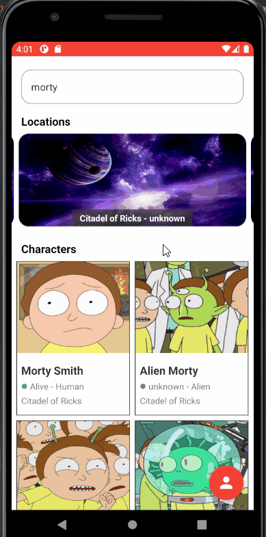

# Epoxy Advanced
Best practices and advanced usages (EditText & Forms) of Epoxy library written in accordance to the Modular and Clean Architectures.

I used [Rick and Morty API](https://rickandmortyapi.com) in this project.

## Technologies
- [Epoxy](https://github.com/airbnb/epoxy)
- MVVM
- Coroutines
- Flow
- Modular Architecture
- Retrofit2
- ViewBinding
- OkHttp
- Gson
- Glide

## App Preview
#### Home Screen

#### Login and Register Screens

There are almost no examples or tutorials about using EditText and creating forms in Epoxy so I wanted to make a sample app, hope it helps!
